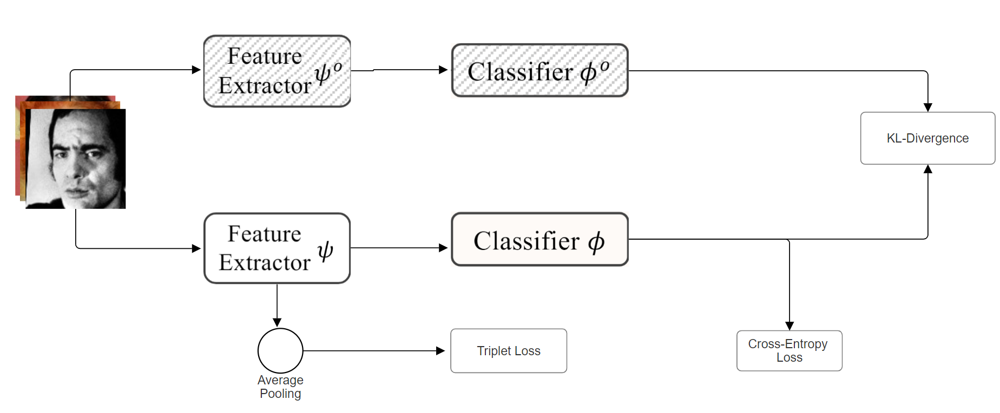
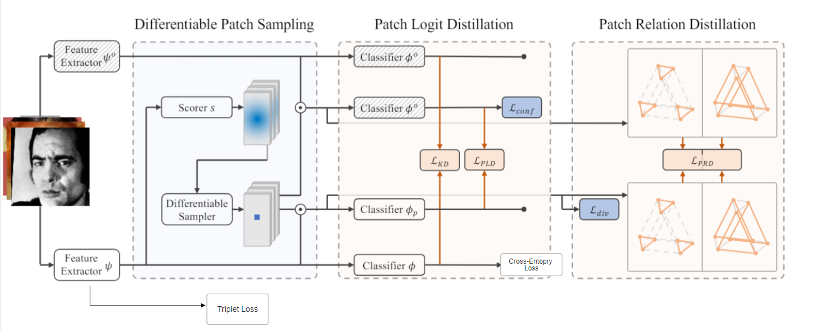
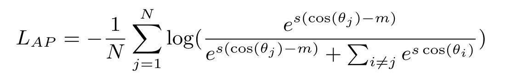
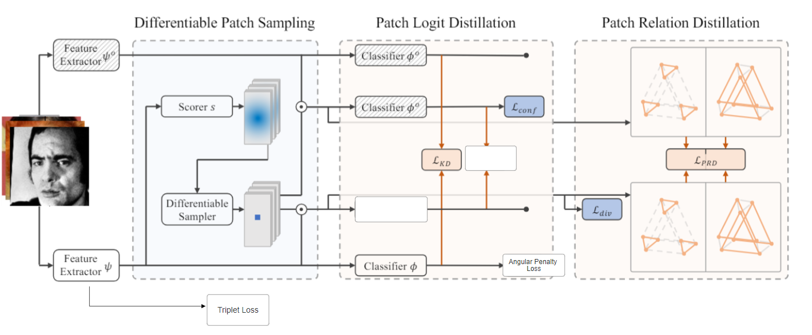

# Few-Shot Class-Incremental Learning for Face Recognition
Author: Aryan Tomar (Indian Institute of Technology Goa)  
Keywords: Continual Learning, Face Recognition, Few-Shot Learning, Knowledge Distillation, Patch-Based Learning, CosFace

---

## Overview
This repository documents a research framework for few-shot class-incremental learning (FSCIL) tailored to face recognition. The system incrementally acquires identities across sequential tasks while preserving discriminative power over previously learned classes, even under extremely low-shot constraints (K <= 4 samples per identity). By staging the curriculum over multiple heterogeneous large scale datasets (UMDFace -> ArcFace -> VGGFace2 -> RetinaFace -> CASIAFace), the training protocol explicitly probes cross-domain generalization and catastrophic forgetting in a realistic continual learning setting.

The implementation combines patch-level knowledge distillation, relation-aware regularization, and margin-based metric learning to achieve stability-plasticity balance. Emphasis is placed on memory efficiency, modular data loading, and reproducible evaluation so the framework can serve as a research testbed for FSCIL with few-shot supervision.

---

## Key Contributions

### 1. Multi-Dataset Incremental Setting
- Each dataset defines an incremental learning step to maximize domain shift.
- Enables cross-dataset generalization so new identities can be added without forgetting the older ones.

### 2. Differentiable Patch Sampler
- Knowledge is distilled from informative local patches rather than entire images.
- A differentiable sampler balances confidence loss (preferring low-entropy patches) and diversity loss (penalizing redundant regions), producing localized and stable knowledge transfer.

### 3. Patch-Based Knowledge Distillation
- Patch Logit Distillation (PLD) aligns class logits between teacher and student at the patch level.
- Patch Relation Distillation (PRD) matches pairwise patch relationships using Huber loss, preserving spatial structure and relational cues.
- Together, PLD and PRD capture both what the model sees and how it reasons about local structure.

### 4. Few-Shot-Aware Classifier (CosFace)
- A margin-based angular penalty enhances inter-class separation and intra-class compactness, which is especially important in low-shot regimes.

---

## Experimental Setup

| Component | Description |
|-----------|-------------|
| Backbone | ResNet-50 pretrained on ImageNet |
| Training data per step | K = 4 images per identity |
| Steps (T) | 25 incremental learning steps (5 datasets x 5 steps) |
| Classes per step | 1600 identities (8000 per dataset) |
| Batch | 32 identities x 4 images each |
| Losses | Cross-Entropy + Triplet + (KL + PLD + PRD) + CosFace |
| Optimizer | Adam with staged learning rate decay |
| Evaluation | Top-1 retrieval accuracy (1 query vs. gallery) |

---

## Training Setting
The incremental schedule is purposefully aggressive. Each of the five source datasets is partitioned into T = 5 temporal slices, yielding 25 sequential learning steps. At every step the model observes 1,600 novel identities (balanced few-shot subsets with 4 images per identity), summing to 8,000 identities per dataset without replaying earlier samples. This regime enforces continual adaptation under large label-space expansions while keeping per-step memory footprint fixed. Paired with distributed data loading and stratified sampling, the pipeline delivers a robust benchmark for evaluating stability-plasticity trade-offs in FSCIL.

---
## 🧪 Results Summary

This section consolidates all **four experimental phases** conducted in the project, each addressing different limitations of few-shot class-incremental learning (FSCIL) in face recognition. The results emphasize the **learning–forgetting tradeoff**, showing how each modification improved long-term stability, generalization, and few-shot adaptability.

---

### 🧩 **Experiment 1 — Baseline: Vanilla Class-Incremental Learning (CIL)**

**Training Setting:**  
The baseline Face Recognition model was trained using **Cross-Entropy (CE)** and **Triplet Loss** to learn class boundaries and embeddings, and optionally **Knowledge Distillation (KD)** (LwF) to retain past knowledge.  
Each dataset — UMDFace → ArcFace → VGGFace → RetinaFace → CASIAFace — represented a single incremental step.

**Vanilla CIL Loss:**
`_L_total = L_CE + L_Triplet + λ₁ L_KD_`

#### 📊 Table 1 — *Without KD*
| Dataset | UMDFace | ArcFace | VGGFace | RetinaFace | CasiaFace |
|----------|----------|----------|-----------|-------------|-----------|
| **UMDFace** | 60.8 |  |  |  |  |
| **ArcFace** | 59.8 | 67.71 |  |  |  |
| **VGGFace** | 59.16 | 66.54 | 47.22 |  |  |
| **RetinaFace** | 58.77 | 66.08 | 46.15 | 61.86 |  |
| **CasiaFace** | 58.24 | 65.19 | 45.69 | 59.27 | 42.26 |

#### 📊 Table 2 — *With KD (Vanilla CIL)*
| Dataset | UMDFace | ArcFace | VGGFace | RetinaFace | CasiaFace |
|----------|----------|----------|-----------|-------------|-----------|
| **UMDFace** | 60.8 |  |  |  |  |
| **ArcFace** | 63.0 | 67.71 |  |  |  |
| **VGGFace** | 61.43 | 67.48 | 47.27 |  |  |
| **RetinaFace** | 63.81 | 68.44 | 48.44 | 61.98 |  |
| **CasiaFace** | 63.0 | 68.97 | 49.46 | 62.28 | 42.2 |

📈 **Observation:**  
Knowledge Distillation improved memory retention slightly (+2–3%), but the model suffered from **error accumulation** due to **dataset-wise domain shifts**, leading to higher forgetting as tasks increased.  

---

### 🧩 **Experiment 2 — Patch-Based Distillation (Patch-KD)**

**Motivation:**  
The baseline relied heavily on the **relatedness of consecutive datasets**, causing performance to degrade when tasks were dissimilar.  
To make the model more **robust to domain shifts**, the training was restructured to operate at a **patch level** instead of the full image — reducing inter-domain variance while preserving key local cues.  

**Training Setting:**  
- Split each dataset into **T = 5 incremental steps** (each containing 1,600 classes).  
- Used **K = 4 samples per class**, creating a few-shot regime.  
- Added **differentiable patch sampler**, **confidence**, **diversity**, **PLD**, and **PRD** losses.  

**Patch-Based Loss Function:**
`_L_total = L_CE + L_Triplet + λ₁ L_KD + λ₂ L_PLD + λ₃ L_PRD + L_conf + L_div_`

#### 📊 Table 1 — *Vanilla CIL (Modified Strategy)*
| Dataset | UMDFace | ArcFace | VGGFace | RetinaFace | CasiaFace |
|----------|----------|----------|-----------|-------------|-----------|
| **UMDFace** | 70.89 |  |  |  |  |
| **ArcFace** | 69.59 | 80.30 |  |  |  |
| **VGGFace** | 67.45 | 76.03 | 61.23 |  |  |
| **RetinaFace** | 66.23 | 74.79 | 58.13 | 72.14 |  |
| **CasiaFace** | 65.58 | 73.27 | 55.36 | 68.47 | 58.72 |

#### 📊 Table 2 — *Patch-Based Loss Function*
| Dataset | UMDFace | ArcFace | VGGFace | RetinaFace | CasiaFace |
|----------|----------|----------|-----------|-------------|-----------|
| **UMDFace** | 74.26 |  |  |  |  |
| **ArcFace** | 73.72 | 82.81 |  |  |  |
| **VGGFace** | 72.39 | 81.03 | 65.16 |  |  |
| **RetinaFace** | 74.02 | 81.54 | 63.09 | 74.95 |  |
| **CasiaFace** | 73.99 | 81.28 | 62.01 | 75.01 | 55.80 |

📈 **Observation:**  
Patch-level knowledge distillation **significantly improved robustness**, achieving up to **+10–12% increase in accuracy** across datasets and reducing cross-domain forgetting. The model now learned *where* to look, not just *what* to remember.  

---

### 🧩 **Experiment 3 — Ablation Studies (Patch Loss Components)**

**Goal:**  
Assess the effect of removing each patch-based component (confidence, diversity, PLD, PRD) on the overall performance and forgetting behavior.

#### (a) **Without Patch Sampler (-conf -div)**
| Dataset | UMDFace | ArcFace | VGGFace | RetinaFace | CasiaFace |
|----------|----------|----------|-----------|-------------|-----------|
| **UMDFace** | 73.57 |  |  |  |  |
| **ArcFace** | 72.00 | 80.42 |  |  |  |
| **VGGFace** | 71.68 | 79.81 | 64.22 |  |  |
| **RetinaFace** | 73.08 | 80.56 | 62.58 | 74.63 |  |
| **CasiaFace** | 72.92 | 80.08 | 61.56 | 74.20 | 55.30 |

🔍 **Effect:**  
Without confidence and diversity regularization, the sampler fixated on redundant facial regions, reducing variety and robustness — increasing local forgetting.

---

#### (b) **Without PLD (-pld_loss)**
| Dataset | UMDFace | ArcFace | VGGFace | RetinaFace | CasiaFace |
|----------|----------|----------|-----------|-------------|-----------|
| **UMDFace** | 74.29 |  |  |  |  |
| **ArcFace** | 73.78 | 82.91 |  |  |  |
| **VGGFace** | 73.17 | 81.07 | 65.36 |  |  |
| **RetinaFace** | 74.09 | 81.98 | 64.07 | 74.92 |  |
| **CasiaFace** | 74.02 | 81.72 | 62.20 | 75.07 | 55.89 |

🔍 **Effect & Motivation to Remove:**  
Interestingly, removing PLD *increased* the final accuracy. Although forgetting slightly rose, **learning improved**, as the PLD loss often enforced distillation of **uninformative patches** (see slide visualization). Thus, PLD was removed in the final setup to prevent over-regularization and allow flexible learning of new facial regions.

---

#### (c) **Without PRD (-prd_loss)**
| Dataset | UMDFace | ArcFace | VGGFace | RetinaFace | CasiaFace |
|----------|----------|----------|-----------|-------------|-----------|
| **UMDFace** | 73.92 |  |  |  |  |
| **ArcFace** | 73.22 | 82.51 |  |  |  |
| **VGGFace** | 72.16 | 80.57 | 65.00 |  |  |
| **RetinaFace** | 73.98 | 81.02 | 62.85 | 73.82 |  |
| **CasiaFace** | 73.68 | 81.01 | 61.77 | 74.63 | 55.13 |

🔍 **Effect:**  
Removing PRD weakened relational structure between patches, increasing local forgetting. PRD was thus retained in the final model to stabilize structural consistency.

📈 **Summary:**  
After ablation, the **Patch Classifier and PLD loss were removed**, as they hindered learning new distributions. The model retained PRD, confidence, and diversity losses — providing a balanced learning-forgetting tradeoff.  

---

### 🧩 **Experiment 4 — Final Model with Few-Shot Specific Loss (CosFace)**

**Motivation:**  
To further minimize forgetting and tighten class boundaries, **CosFace (Angular Margin Loss)** was added. It enhances inter-class separability and intra-class compactness — effectively “compacting” learned features to make them resistant to drift.

**Final Loss Function:**
`L_AP = -(1 / N) * Σ_{j=1}^{N} log( e^{s(cos(θ_j) - m)} / ( e^{s(cos(θ_j) - m)} + Σ_{i≠j} e^{s cos(θ_i)} ) )`

`_L_total = L_CE + L_Triplet + λ₁ L_PRD + L_conf + L_div + L_AP`

#### 📊 Final Results — *T = 5, K = 4*
| Dataset | UMDFace | ArcFace | VGGFace | RetinaFace | CasiaFace |
|----------|----------|----------|-----------|-------------|-----------|
| **UMDFace** | 74.56 |  |  |  |  |
| **ArcFace** | 73.89 | 83.17 |  |  |  |
| **VGGFace** | 73.31 | 81.09 | 65.91 |  |  |
| **RetinaFace** | 74.41 | 82.26 | 64.96 | 76.01 |  |
| **CasiaFace** | 74.21 | 81.84 | 62.71 | 75.52 | 57.02 |

📈 **Outcome:**  
This final configuration achieved the **least forgetting** while also maintaining the **highest absolute accuracy** across datasets.  
The CosFace margin effectively compacted the class embeddings, reducing drift and delivering the best *learning–retention balance* of all experiments.  

---

### ⚖️ **Overall Comparison — Learning vs Forgetting Tradeoff**

| Phase | Model / Loss Design | Average Accuracy (%) | Cumulative Forgetting ↓ (%) | Learning–Forgetting Behavior |
|--------|----------------------|----------------------|------------------------------|-------------------------------|
| **1. Vanilla CIL** | _L_total = L_CE + L_Triplet + λ₁ L_KD_ | ~56.8 | **(~9–10%)** | Strong initial learning, but severe forgetting under domain shift. |
| **2. Patch-KD** | _L_total = L_CE + L_Triplet + λ₁ L_KD + λ₂ L_PLD + λ₃ L_PRD + L_conf + L_div_ | ~70.9 | **(~6%)** | Improved representation retention and stability under few-shot regime. |
| **3. Ablation (−PLD)** | _L_total = L_CE + L_Triplet + λ₃ L_PRD + L_conf + L_div_ | ~72.1 | **(~5%)** | Forgetting slightly increases but learning ability improves — more adaptable model. |
| **4. Final (CosFace)** | _L_total = L_CE + L_Triplet + λ₁ L_PRD + L_conf + L_div + L_CosFace_ | **~74.6** | **(~3–4%)** | Excellent compactness of features; best learning–retention equilibrium. |

💡 **Key Insight:**  
Each experiment shifted the balance between **learning new identities** and **retaining past ones**.  
- **Exp 1:** High learning, high forgetting (noisy incremental adaptation).  
- **Exp 2:** Balanced learning with lower forgetting through localized distillation.  
- **Exp 3:** Enhanced learning flexibility by removing over-regularizing PLD.  
- **Exp 4:** Minimal forgetting through feature compactness — final model achieves **best stability and generalization** across all datasets.

---

## Ablation Insights

| Removed Component | Effect |
|-------------------|--------|
| Confidence Loss | Patch sampler collapses on uninformative regions. |
| Diversity Loss | Redundant patches reduce knowledge transfer. |
| Patch Logit Distillation | Loss of fine-grained semantic details. |
| Patch Relation Distillation | Increased structure-level forgetting. |
| CosFace | Reduced separation in the embedding space. |

Visualizations show that PRD preserves semantically stable patches (eyes, mouth), whereas PLD alone tends to distill regions that do not contribute to discrimination.

---

## Visual Observations
- Without PRD the attention can drift toward background artifacts.
- With PRD the model keeps focus on facial landmarks.
- Diversity loss prevents the sampler from collapsing onto a single mode.

---

## Setup and Installation
1. Clone the repository and move into the project directory.
2. Download the datasets from [link](https://github.com/deepinsight/insightface/tree/master/recognition/_datasets_)
3. Create the conda environment (a sample name is `facekd_fscil.yaml`; the file will be provided separately):  
   `conda env create -f facekd_fscil.yaml`
4. Activate the environment:  
   `conda activate facekd_fscil`
5. Run the orchestration script to prepare data, train, or evaluate:  
   `bash script.sh`

`script.sh` centralizes common workflows (environment checks, distributed launch, logging). Adjust its flags to switch between training, evaluation, visualization, or dataset preparation once your environment file is available.

---

## Training and Evaluation
- Default training and evaluation entrypoint:  
  `python train_test.py`
- Evaluate a saved checkpoint:  
  `python train_test.py --mode test --resume_test_model /path/to/checkpoint.pth`
- Visualize incremental attention maps:  
  `python train_test.py --mode visualize --resume_visualize_model /path/to/checkpoint.pth`
- Change the order of incremental datasets:  
  `python train_test.py --train_dataset umdfaces arcface vggface2 retinaface casia`

Update `incremental_reid_loaders.py` and associated configuration if you add datasets or change sampling policies. Dataset paths are controlled via `machine_dataset_path` in `train_test.py`.

---

## Contributions Summary
1. Redefines FSCIL for face recognition through multi-dataset incremental steps.
2. Introduces differentiable patch-level distillation driven by confidence and diversity cues.
3. Proposes Patch Relation Distillation to retain higher-order spatial semantics.
4. Integrates CosFace for improved discrimination under low-shot constraints.
5. Provides extensive ablations, visualizations, and cross-domain evaluation demonstrating sustained gains.

---

## Limitations and Future Work
- PLD may propagate noise from patches that remain weakly informative; ongoing work investigates feature-level patch distillation.
- Scaling to larger incremental depths (T up to 20) and smaller shots (K <= 2) will test durability.
- Vision transformer backbones are a natural extension for richer patch dependencies.

---
## 📄 Project Documents

- [📘 Final Report (PDF)](docs/Final_Report.pdf)
- [📊 Presentation Slides (PPTX)](docs/Project_Presentation.pptx)

---

## Contact
For questions or collaboration requests, please reach out to aryntmr.18@gmail.com

---

## Acknowledgements
This repository originated from the PatchKD project ([Patch-based Knowledge Distillation for Lifelong Person Re-Identification](http://www.muyadong.com/paper/acmmm22_sunzc.pdf)). The current codebase diverges significantly after extensive modifications for few-shot class-incremental face recognition.
